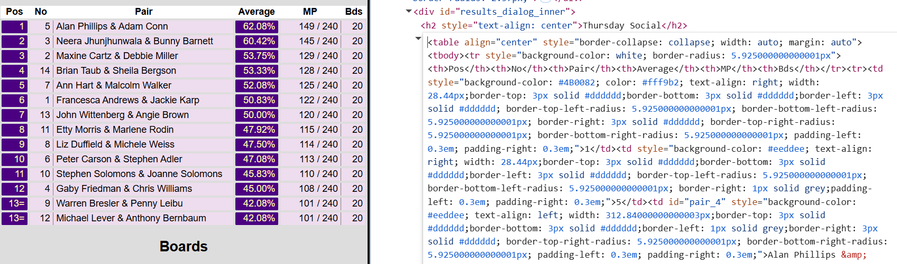

Developed for Aggregation of Ace of Clubs bridge club results.  
Add results by creating a new competition at comps/new and adding the relevant table html from the official results website to the Result field.  
e.g. [example results](https://play.realbridge.online/dx.html?p=250612125783&q=ThursdayEvening12June#0)  
 
The competition controller's create method uses the Scrape class (reformat needed) to process the results's html into players, pairs and score.   
Clues to an early attempt to fully automate may be found in 'browser request.txt'.  
To avoid webpacker issues, may need to run tests with:  
 ` export NODE_OPTIONS=--openssl-legacy-provider `  
 (though solid tests not implemented)